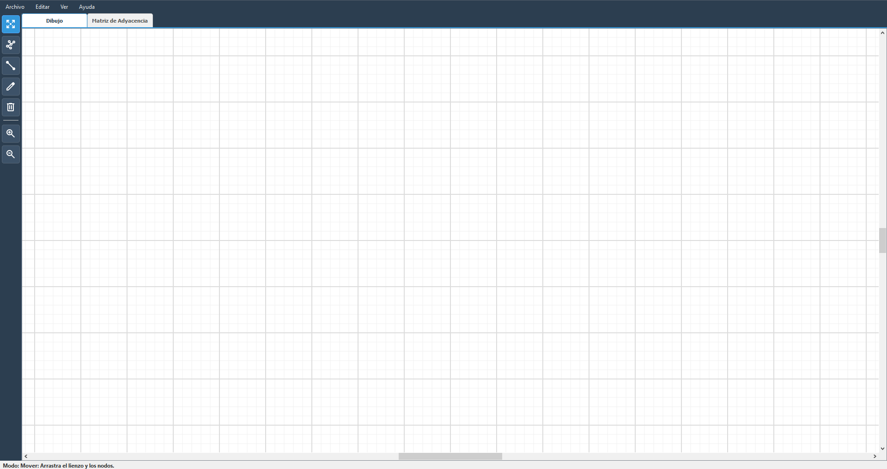
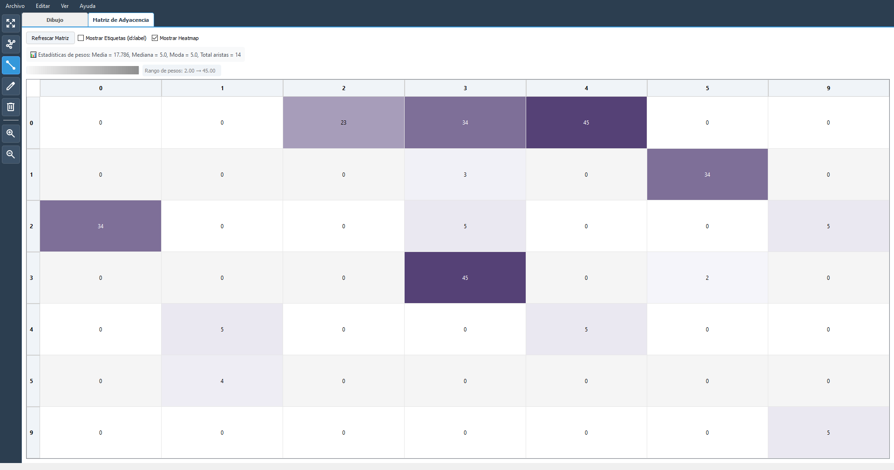
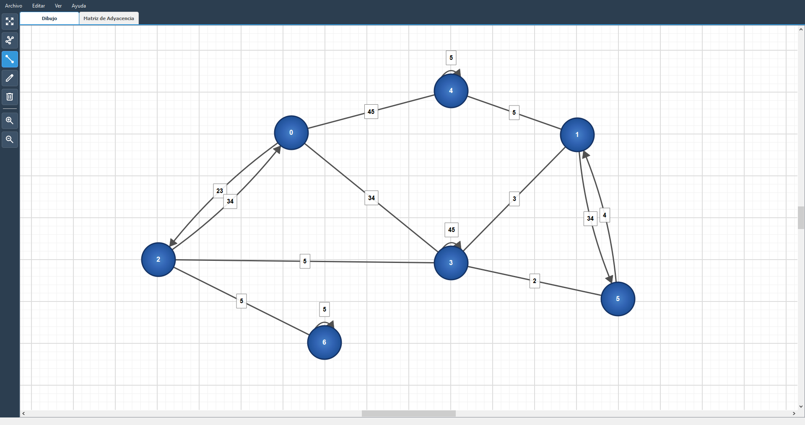
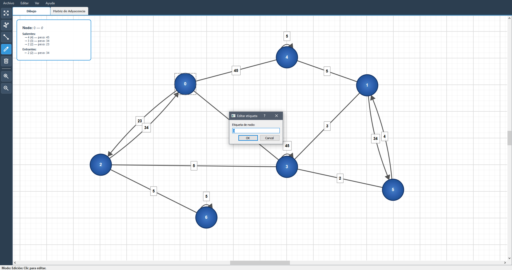

# 🎓 Grafo Drawer - Visualizador de Grafos Dirigidos

<div align="center">


**Herramienta profesional para la visualización, creación y análisis de grafos dirigidos**

Desarrollado como parte del Servicio Social en la **Universidad Autónoma de Querétaro (UAQ)**  
Facultad de Informática

---

### 👨‍💻 Desarrollador
**Román Ortega Muñoz**  
Prestador de Servicio Social - UAQ

---

</div>

## 📋 Tabla de Contenidos

- [Descripción](#-descripción)
- [Características](#-características)
- [Capturas de Pantalla](#-capturas-de-pantalla)
- [Requisitos del Sistema](#-requisitos-del-sistema)
- [Instalación](#-instalación)
- [Manual de Usuario](#-manual-de-usuario)
  - [Modos de Interacción](#1-modos-de-interacción)
  - [Gestión de Archivos](#2-gestión-de-archivos)
  - [Visualización](#3-visualización)
  - [Matriz de Adyacencia](#4-matriz-de-adyacencia)
  - [Atajos de Teclado](#5-atajos-de-teclado)
- [Documentación Técnica](#-documentación-técnica)
  - [Arquitectura del Proyecto](#arquitectura-del-proyecto)
  - [Estructura de Archivos](#estructura-de-archivos)
  - [Componentes Principales](#componentes-principales)
  - [Formato de Datos](#formato-de-datos)
- [Contribuciones](#-contribuciones)
- [Licencia](#-licencia)
- [Contacto](#-contacto)

---

## 🎯 Descripción

**Grafo Drawer** es una aplicación de escritorio desarrollada en Python con PyQt5 que permite a estudiantes, profesores e investigadores crear, visualizar y analizar grafos dirigidos de manera intuitiva. La herramienta ofrece una interfaz gráfica moderna y fácil de usar, ideal para el estudio de estructuras de datos, teoría de grafos y algoritmos.

Este proyecto fue desarrollado como parte de las actividades de Servicio Social en la **Facultad de Informática de la Universidad Autónoma de Querétaro (UAQ)**, con el objetivo de proporcionar una herramienta educativa de calidad para la comunidad académica.

### 🎓 Contexto Académico

- **Institución**: Universidad Autónoma de Querétaro (UAQ)
- **Facultad**: Facultad de Informática
- **Propósito**: Herramienta educativa para el estudio de Teoría de Grafos
- **Modalidad**: Proyecto de Servicio Social

---

## ✨ Características

### 🎨 Interfaz Gráfica Intuitiva
- **Diseño moderno** con temas oscuros y claros
- **Visualización en tiempo real** de grafos dirigidos
- **Zoom y navegación fluida** con controles de mouse y teclado
- **Imagen de fondo personalizable** para contexto adicional

### 🛠️ Herramientas de Edición
- **Cinco modos de interacción**: Mover, Dibujar, Aristas, Editar, Borrar
- **Creación intuitiva de nodos** con un solo clic
- **Conexión de nodos** mediante aristas dirigidas con pesos
- **Edición de etiquetas** y pesos en tiempo real
- **Ajuste dinámico del tamaño** de los nodos
- **Soporte para bucles** (aristas de un nodo a sí mismo)
- **Detección automática** de aristas bidireccionales con visualización optimizada

### 📊 Análisis y Visualización
- **Matriz de adyacencia interactiva** con:
  - Visualización con etiquetas de nodos
  - Heatmap de colores para pesos
  - Estadísticas automáticas (promedio, mediana, min, max)
  - Exportación a CSV y JSON
- **Cuadrícula opcional** para alineación precisa
- **Mostrar/ocultar pesos** de aristas
- **Panel de información** de nodos seleccionados

### 💾 Gestión de Archivos
- **Guardar y cargar** proyectos en formato JSON
- **Exportación múltiple**:
  - Imagen PNG/JPG del grafo visual
  - Estructura del grafo en JSON
  - Matriz de adyacencia en CSV/JSON
- **Historial de archivos recientes** para acceso rápido
- **Confirmación de cambios** antes de cerrar o crear nuevo archivo

### 🎯 Características Técnicas
- Renderizado con **antialiasing** para gráficos de alta calidad
- **Selección múltiple** de elementos
- **Integración con NetworkX** para análisis de grafos
- **Sistema de coordenadas** con límites configurables
- **Arquitectura MVC** limpia y extensible

---

## 📸 Capturas de Pantalla

### 🖼️ Vista Principal
<div align="center">
  
  <p><em>Interfaz principal con un grafo de ejemplo mostrando nodos, aristas y controles</em></p>
</div>

### 📊 Matriz de Adyacencia
<div align="center">
  
  <p><em>Vista de matriz de adyacencia con visualización de heatmap y estadísticas</em></p>
</div>

### 🎨 Modo de Dibujo
<div align="center">
  
  <p><em>Modo de dibujo para crear nodos con facilidad</em></p>
</div>

### ✏️ Modo de Edición
<div align="center">
  
  <p><em>Modo de edición para modificar etiquetas y pesos de nodos y aristas</em></p>
</div>

---

## 💻 Requisitos del Sistema

### Software Requerido
- **Python**: 3.8 o superior
- **Sistema Operativo**: Windows, macOS o Linux

### Bibliotecas Python
- PyQt5 >= 5.15.0
- NetworkX >= 2.6.0

---

## 🚀 Instalación

### Paso 1: Clonar el Repositorio

```bash
git clone https://github.com/TU_USUARIO/mi-grafos-desktop.git
cd mi-grafos-desktop
```

### Paso 2: Crear Entorno Virtual (Recomendado)

**Windows:**
```powershell
python -m venv venv
.\venv\Scripts\activate
```

**macOS/Linux:**
```bash
python3 -m venv venv
source venv/bin/activate
```

### Paso 3: Instalar Dependencias

```bash
pip install -r requirements.txt
```

### Paso 4: Ejecutar la Aplicación

```bash
python main.py
```

---

## 📖 Manual de Usuario

### 1. Modos de Interacción

Grafo Drawer ofrece cinco modos de interacción que puedes cambiar desde la barra de herramientas lateral o con atajos de teclado:

#### 🔷 Modo Mover (P)
- **Función**: Navegar por el lienzo y reposicionar nodos
- **Uso**:
  - **Clic izquierdo + arrastrar** sobre un nodo: Mover el nodo
  - **Clic central + arrastrar**: Desplazar el lienzo
  - **Rueda del mouse**: Desplazamiento vertical/horizontal
  - **Ctrl + Rueda**: Zoom in/out

#### 🔷 Modo Dibujar (D)
- **Función**: Crear nuevos nodos en el grafo
- **Uso**:
  - **Clic en el lienzo**: Crear un nuevo nodo
  - Se abrirá un diálogo para ingresar la etiqueta del nodo
  - El nodo se creará en la posición del cursor

#### 🔷 Modo Aristas (E)
- **Función**: Conectar nodos con aristas dirigidas
- **Uso**:
  - **Primer clic**: Seleccionar nodo origen
  - **Segundo clic**: Seleccionar nodo destino
  - Se abrirá un diálogo para ingresar el peso de la arista
  - Puedes crear bucles haciendo clic dos veces en el mismo nodo
  - Las aristas bidireccionales se curvan automáticamente para mejor visualización

#### 🔷 Modo Editar (T)
- **Función**: Modificar etiquetas de nodos o pesos de aristas
- **Uso**:
  - **Clic en un nodo**: Editar su etiqueta
  - **Clic en una arista**: Editar su peso
  - Se abrirá un diálogo con el valor actual para editarlo

#### 🔷 Modo Borrar (X)
- **Función**: Eliminar nodos o aristas
- **Uso**:
  - **Clic en un nodo**: Eliminar el nodo y todas sus aristas conectadas
  - **Clic en una arista**: Eliminar solo la arista
  - También puedes seleccionar elementos y presionar **Del**

### 2. Gestión de Archivos

#### Nuevo Archivo
- **Menú**: Archivo → Nuevo
- **Atajo**: `Ctrl+N`
- Crea un lienzo vacío (solicita guardar cambios pendientes)

#### Abrir Archivo
- **Menú**: Archivo → Abrir
- **Atajo**: `Ctrl+O`
- Carga un grafo guardado previamente en formato JSON
- Accede a archivos recientes desde: Archivo → Abrir Recientes

#### Guardar
- **Menú**: Archivo → Guardar
- **Atajo**: `Ctrl+S`
- Guarda el grafo actual en su archivo asociado
- Si es un archivo nuevo, solicitará un nombre

#### Guardar Como
- **Menú**: Archivo → Guardar Como
- **Atajo**: `Ctrl+Shift+S`
- Guarda el grafo con un nuevo nombre de archivo

#### Exportar

**Grafo a JSON**
- **Menú**: Archivo → Exportar → Grafo a JSON
- Exporta la estructura completa del grafo (nodos, aristas, posiciones)

**Dibujo a Imagen**
- **Menú**: Archivo → Exportar → Dibujo a Imagen (PNG/JPG)
- Guarda una imagen de alta calidad del grafo visual
- Formatos: PNG (con transparencia) o JPEG

**Matriz a CSV**
- **Menú**: Archivo → Exportar → Matriz a CSV
- Exporta la matriz de adyacencia en formato CSV
- Compatible con Excel y otras hojas de cálculo

**Matriz a JSON**
- **Menú**: Archivo → Exportar → Matriz a JSON
- Exporta la matriz de adyacencia en formato JSON estructurado

### 3. Visualización

#### Controles de Zoom
- **Aumentar Zoom**: `Ctrl++` o botón de herramientas
- **Disminuir Zoom**: `Ctrl+-` o botón de herramientas
- **Zoom con rueda**: `Ctrl + Rueda del mouse`
- **Ajustar a vista**: `F` (ajusta el zoom para ver todo el grafo)

#### Personalización Visual

**Tamaño de Nodos**
- **Menú**: Editar → Cambiar Tamaño de Nodos
- **Aumentar**: `Ctrl+Up`
- **Disminuir**: `Ctrl+Down`
- Rango: 10-200 píxeles de radio

**Imagen de Fondo**
- **Cargar**: Ver → Cargar Imagen de Fondo
- **Quitar**: Ver → Quitar Imagen de Fondo
- Formatos soportados: PNG, JPG, JPEG
- Útil para mapas, diagramas o contexto visual

**Cuadrícula**
- **Toggle**: Ver → Mostrar Cuadrícula
- Ayuda a alinear nodos de forma precisa
- Se puede activar/desactivar en cualquier momento

**Pesos de Aristas**
- **Toggle**: Ver → Mostrar Pesos de Aristas
- Muestra u oculta las etiquetas de peso en todas las aristas

### 4. Matriz de Adyacencia

La pestaña "Matriz de Adyacencia" ofrece una visualización tabular del grafo:

#### Funcionalidades

**Refrescar Matriz**
- Actualiza la matriz con los cambios más recientes del grafo
- También se actualiza automáticamente al modificar el grafo

**Mostrar Etiquetas**
- Checkbox para mostrar etiquetas en formato `id:etiqueta`
- Facilita la identificación de nodos en grafos grandes

**Heatmap**
- Visualización con colores basada en los pesos
- Gradiente de azul (bajo) a rojo (alto)
- Incluye leyenda con valores mínimo y máximo

**Estadísticas**
- Promedio de pesos
- Mediana
- Valor mínimo
- Valor máximo
- Desviación estándar

**Copiar Celda**
- **Doble clic** en cualquier celda para copiar su valor al portapapeles

### 5. Atajos de Teclado

#### Modos de Interacción
| Atajo | Acción |
|-------|--------|
| `P` | Modo Mover |
| `D` | Modo Dibujar |
| `E` | Modo Aristas |
| `T` | Modo Editar |
| `X` | Modo Borrar |

#### Gestión de Archivos
| Atajo | Acción |
|-------|--------|
| `Ctrl+N` | Nuevo archivo |
| `Ctrl+O` | Abrir archivo |
| `Ctrl+S` | Guardar |
| `Ctrl+Shift+S` | Guardar como |
| `Ctrl+Q` | Salir |

#### Edición
| Atajo | Acción |
|-------|--------|
| `Del` | Borrar selección |
| `Ctrl+A` | Seleccionar todo |
| `Ctrl+Up` | Aumentar tamaño nodos |
| `Ctrl+Down` | Disminuir tamaño nodos |

#### Visualización
| Atajo | Acción |
|-------|--------|
| `F` | Ajustar a vista |
| `Ctrl++` | Aumentar zoom |
| `Ctrl+-` | Disminuir zoom |
| `M` | Ver matriz de adyacencia |

---

## 🔧 Documentación Técnica

### Arquitectura del Proyecto

Grafo Drawer sigue una arquitectura **Modelo-Vista-Controlador (MVC)** adaptada para aplicaciones PyQt5:

```
┌─────────────────────────────────────────────────────────┐
│                     MainWindow                          │
│                   (Controlador)                         │
│  - Gestión de archivos                                  │
│  - Coordinación de vistas                               │
│  - Manejo de eventos del usuario                        │
└─────────────────────────────────────────────────────────┘
                    │              │
        ┌───────────┘              └───────────┐
        ▼                                      ▼
┌──────────────────┐                  ┌──────────────────┐
│   GraphView      │                  │  MatrixWidget    │
│   (Vista 1)      │                  │   (Vista 2)      │
│ - Renderizado    │                  │ - Tabla          │
│ - Interacción    │                  │ - Estadísticas   │
└──────────────────┘                  └──────────────────┘
        │                                      │
        └───────────┐              ┌───────────┘
                    ▼              ▼
            ┌──────────────────────────┐
            │      GraphScene          │
            │      (Modelo)            │
            │  - Nodos (NodeItem)      │
            │  - Aristas (EdgeItem)    │
            │  - Lógica del grafo      │
            └──────────────────────────┘
```

### Estructura de Archivos

```
mi-grafos-desktop/
│
├── main.py                 # Punto de entrada, ventana principal
├── graph_widgets.py        # Componentes gráficos del grafo
├── matrix_view.py          # Widget de matriz de adyacencia
├── utils.py                # Utilidades y constantes
│
├── icons/                  # Iconos SVG para la interfaz
│   ├── move.svg
│   ├── draw.svg
│   ├── edge.svg
│   ├── edit.svg
│   ├── delete.svg
│   ├── zoom_in.svg
│   └── zoom_out.svg
│
├── requirements.txt        # Dependencias Python
├── README.md              # Este archivo
└── .gitignore             # Archivos ignorados por Git
```

### Componentes Principales

#### 1. `main.py` - MainWindow

**Responsabilidades:**
- Gestión de la ventana principal y menús
- Coordinación entre vista de dibujo y matriz
- Sistema de archivos (abrir, guardar, exportar)
- Gestión de configuraciones y preferencias
- Manejo de atajos de teclado

**Clases:**
- `MainWindow`: Ventana principal de la aplicación

#### 2. `graph_widgets.py` - Componentes Gráficos

**Responsabilidades:**
- Representación visual de nodos y aristas
- Manejo de interacciones del usuario con el grafo
- Lógica de renderizado y geometría

**Clases:**
- `NodeItem`: Representa un nodo visual (círculo con etiqueta)
- `EdgeItem`: Representa una arista dirigida con peso
- `GraphScene`: Escena que contiene el grafo y maneja la lógica
- `GraphView`: Vista personalizada con controles de navegación

**Características de NodeItem:**
- Geometría circular con radio ajustable
- Gradiente radial para efecto visual
- Etiqueta de texto centrada
- Efectos hover (cambio de color al pasar el mouse)
- Límites de movimiento dentro del lienzo
- Actualización automática de aristas conectadas

**Características de EdgeItem:**
- Líneas dirigidas con flechas
- Soporte para bucles (self-loops) con trayectoria curva
- Detección de aristas bidireccionales con curvatura automática
- Etiquetas de peso con fondo semitransparente
- Efectos hover para selección visual
- Cálculo dinámico de geometría

**Características de GraphScene:**
- Cinco modos de interacción (mover, dibujar, aristas, editar, borrar)
- Sistema de señales para notificar cambios
- Serialización/deserialización a JSON
- Cuadrícula opcional para alineación
- Imagen de fondo opcional
- Gestión de IDs únicos para nodos

#### 3. `matrix_view.py` - MatrixWidget

**Responsabilidades:**
- Visualización de matriz de adyacencia
- Cálculo de estadísticas de pesos
- Generación de heatmap visual
- Exportación de matriz a CSV/JSON

**Características:**
- Tabla interactiva con selección de celdas
- Checkbox para mostrar/ocultar etiquetas
- Heatmap con gradiente de colores configurable
- Leyenda visual del gradiente
- Estadísticas automáticas (promedio, mediana, min, max, desviación estándar)
- Doble clic para copiar valores al portapapeles
- Actualización automática al cambiar el grafo

#### 4. `utils.py` - Utilidades

**Responsabilidades:**
- Definición de constantes globales
- Funciones helper para colores y diálogos
- Carga de recursos (iconos)

**Constantes:**
- `DEFAULT_NODE_RADIUS`: Radio predeterminado de nodos (40px)
- `SCENE_FINITE_RECT`: Límites del lienzo (-7500 a 7500)
- `MIN_ZOOM_LEVEL` / `MAX_ZOOM_LEVEL`: Límites de zoom (10% - 1000%)
- `ARROW_SIZE`: Tamaño de flechas en aristas (20px)
- `FONT_NODE` / `FONT_EDGE`: Fuentes para texto

**Funciones:**
- `load_icon(name)`: Carga iconos SVG
- `make_radial_brush(...)`: Crea pinceles con gradiente
- `show_warning(...)` / `show_info(...)`: Diálogos de usuario
- `_mix_color(...)`: Interpolación de colores

### Formato de Datos

#### Estructura JSON del Grafo

Los archivos guardados tienen la siguiente estructura:

```json
{
  "nodes": [
    {
      "id": 1,
      "label": "A",
      "x": 150.5,
      "y": 200.3,
      "radius": 40
    },
    {
      "id": 2,
      "label": "B",
      "x": 350.2,
      "y": 200.8,
      "radius": 40
    }
  ],
  "edges": [
    {
      "source": 1,
      "dest": 2,
      "weight": "5"
    },
    {
      "source": 2,
      "dest": 1,
      "weight": "3"
    }
  ],
  "background_image": "ruta/a/imagen.png",
  "background_position": {
    "x": 0.0,
    "y": 0.0
  },
  "background_scale": 1.0
}
```

**Campos:**
- `nodes`: Array de nodos del grafo
  - `id`: Identificador único del nodo (entero)
  - `label`: Etiqueta visible del nodo (string)
  - `x`, `y`: Posición en coordenadas de la escena (float)
  - `radius`: Radio del círculo del nodo en píxeles (int)
- `edges`: Array de aristas dirigidas
  - `source`: ID del nodo origen (int)
  - `dest`: ID del nodo destino (int)
  - `weight`: Peso de la arista (string, puede ser numérico)
- `background_image`: Ruta opcional a imagen de fondo (string)
- `background_position`: Coordenadas de la imagen de fondo
- `background_scale`: Factor de escala de la imagen

#### Formato CSV de Matriz

```csv
,1,2,3
1,0,5,0
2,3,0,7
3,0,0,0
```

- Primera fila y columna: IDs de nodos
- Celdas: Peso de la arista (0 si no existe)

### Tecnologías Utilizadas

| Tecnología | Versión | Propósito |
|------------|---------|-----------|
| Python | 3.8+ | Lenguaje principal |
| PyQt5 | 5.15+ | Framework de interfaz gráfica |
| NetworkX | 2.6+ | Análisis de grafos |
| Qt Graphics View Framework | - | Renderizado de gráficos 2D |

### Flujo de Ejecución

1. **Inicialización** (`main()`)
   - Crear `QApplication`
   - Instanciar `MainWindow`
   - Mostrar ventana
   - Iniciar event loop

2. **Creación de Componentes**
   - Crear `GraphScene` (modelo)
   - Crear `GraphView` (vista de dibujo)
   - Crear `MatrixWidget` (vista de matriz)
   - Configurar menús y barras de herramientas
   - Conectar señales y slots

3. **Interacción del Usuario**
   - Captura de eventos de mouse/teclado
   - Delegación al modo activo
   - Actualización del modelo (GraphScene)
   - Emisión de señal `graph_changed`
   - Actualización automática de vistas

4. **Persistencia**
   - Serialización del grafo a JSON
   - Guardado en archivo
   - Carga desde archivo
   - Restauración del estado visual

### Extensibilidad

El proyecto está diseñado para ser extensible:

**Agregar nuevos modos de interacción:**
1. Definir lógica en `GraphScene.handle_XXX_click()`
2. Agregar acción en `MainWindow._create_vertical_toolbar()`
3. Asignar atajo de teclado

**Agregar nuevas exportaciones:**
1. Implementar método `export_XXX()` en clase correspondiente
2. Agregar entrada en menú Exportar

**Personalizar apariencia:**
1. Modificar constantes en `utils.py`
2. Ajustar estilos CSS en `MainWindow._apply_style()`

---

## 🤝 Contribuciones

Este proyecto fue desarrollado como parte del Servicio Social en la UAQ. Si deseas contribuir:

1. Fork el repositorio
2. Crea una rama para tu feature (`git checkout -b feature/AmazingFeature`)
3. Commit tus cambios (`git commit -m 'Add some AmazingFeature'`)
4. Push a la rama (`git push origin feature/AmazingFeature`)
5. Abre un Pull Request

---

## 📄 Licencia

Este proyecto fue desarrollado con fines educativos como parte del Servicio Social en la Universidad Autónoma de Querétaro.

---

## 📞 Contacto

**Román Ortega Muñoz**  
Prestador de Servicio Social  
Facultad de Informática  
Universidad Autónoma de Querétaro (UAQ)

---

<div align="center">

**Hecho con ❤️ en la UAQ**

*Desarrollado como contribución a la comunidad educativa de la Facultad de Informática*

</div>
